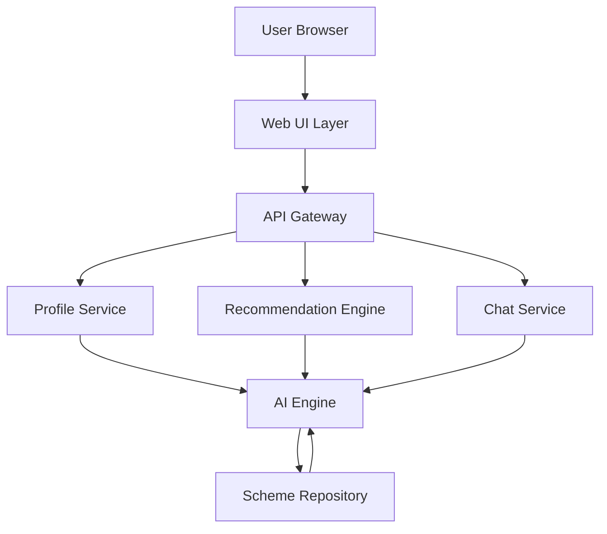

# Design Document: HerWay Platform

## Overview

HerWay is a web-based platform that leverages AI to democratize access to government schemes and scholarships for women in India. The system consists of three main layers:

1. **Presentation Layer**: A bilingual (English/Hindi) web interface with a conversational chat system
2. **AI Processing Layer**: Natural language processing for summarization, recommendation, and Q&A
3. **Data Layer**: A structured repository of government schemes with metadata

The platform operates as a stateless, session-based application requiring no user authentication, making it accessible for rapid prototyping and hackathon demonstration.

### Key Design Principles

- **Accessibility First**: No login barriers, mobile-responsive, bilingual support
- **AI-Driven Personalization**: Intelligent matching based on user eligibility
- **Simplicity**: Plain language summaries, clear navigation, minimal cognitive load
- **Privacy**: No persistent data storage, session-only user information

## Architecture

### System Architecture



### Component Responsibilities

**Web UI Layer**:
- Renders bilingual interface (English/Hindi)
- Collects user profile information
- Displays scheme recommendations
- Provides chat interface
- Manages session state in browser

**API Gateway**:
- Routes requests to appropriate services
- Handles language selection
- Manages session context
- Returns formatted responses

**Profile Service**:
- Validates user input
- Structures user profile data
- Passes profile to recommendation engine

**Recommendation Engine**:
- Evaluates eligibility criteria
- Ranks schemes by relevance
- Returns filtered and sorted scheme list

**Chat Service**:
- Processes natural language questions
- Maintains conversation context
- Generates contextual responses

**AI Engine**:
- Summarizes schemes in simple language
- Translates content between English and Hindi
- Processes eligibility matching logic
- Generates conversational responses

**Scheme Repository**:
- Stores scheme metadata (name, description, eligibility, benefits, process)
- Provides query interface for scheme retrieval
- Maintains bilingual content

## Components and Interfaces

### 1. User Profile Component

**Purpose**: Collect and validate user information for personalized recommendations.

**Data Structure**:
```typescript
interface UserProfile {
  age: number;
  educationLevel: EducationLevel;
  incomeBracket: IncomeBracket;
  employmentStatus: EmploymentStatus;
  language: Language;
}

enum EducationLevel {
  BelowHighSchool = "below_high_school",
  HighSchool = "high_school",
  Undergraduate = "undergraduate",
  Graduate = "graduate",
  Postgraduate = "postgraduate"
}

enum IncomeBracket {
  Below2Lakh = "below_2_lakh",
  Between2And5Lakh = "2_to_5_lakh",
  Between5And10Lakh = "5_to_10_lakh",
  Above10Lakh = "above_10_lakh"
}

enum EmploymentStatus {
  Student = "student",
  Employed = "employed",
  SelfEmployed = "self_employed",
  Unemployed = "unemployed",
  Homemaker = "homemaker"
}

enum Language {
  English = "en",
  Hindi = "hi"
}
```

**Interface**:
```typescript
interface ProfileService {
  validateProfile(profile: UserProfile): ValidationResult;
  createProfile(formData: FormData): UserProfile;
}

interface ValidationResult {
  isValid: boolean;
  errors: ValidationError[];
}

interface ValidationError {
  field: string;
  message: string;
}
```

### 2. Scheme Repository Component

**Purpose**: Store and retrieve government scheme information.

**Data Structure**:
```typescript
interface Scheme {
  id: string;
  name: LocalizedString;
  description: LocalizedString;
  summary: LocalizedString;
  eligibility: EligibilityCriteria;
  benefits: LocalizedString[];
  applicationProcess: ApplicationStep[];
  targetAudience: TargetAudience[];
  category: SchemeCategory;
}

interface LocalizedString {
  en: string;
  hi: string;
}

interface EligibilityCriteria {
  minAge?: number;
  maxAge?: number;
  educationLevels: EducationLevel[];
  incomeBrackets: IncomeBracket[];
  employmentStatuses: EmploymentStatus[];
}

interface ApplicationStep {
  stepNumber: number;
  description: LocalizedString;
}

enum TargetAudience {
  Students = "students",
  WorkingWomen = "working_women",
  UnderservedCommunities = "underserved_communities"
}

enum SchemeCategory {
  Education = "education",
  Employment = "employment",
  Healthcare = "healthcare",
  Financial = "financial",
  Entrepreneurship = "entrepreneurship"
}
```

**Interface**:
```typescript
interface SchemeRepository {
  getAllSchemes(): Scheme[];
  getSchemeById(id: string): Scheme | null;
  getSchemesByCategory(category: SchemeCategory): Scheme[];
}
```

### 3. AI Engine Component

**Purpose**: Process natural language, generate summaries, and provide intelligent responses.

**Subcomponents**:

**Summarization Module**:
```typescript
interface SummarizationService {
  summarizeScheme(scheme: Scheme, language: Language): string;
  simplifyText(text: string, language: Language): string;
}
```

**Translation Module**:
```typescript
interface TranslationService {
  translate(text: string, targetLanguage: Language): string;
  getLocalizedContent(content: LocalizedString, language: Language): string;
}
```

**Eligibility Matching Module**:
```typescript
interface EligibilityMatcher {
  matchSchemes(profile: UserProfile, schemes: Scheme[]): MatchResult[];
  calculateRelevanceScore(profile: UserProfile, scheme: Scheme): number;
}

interface MatchResult {
  scheme: Scheme;
  relevanceScore: number;
  matchedCriteria: string[];
}
```

### 4. Recommendation Engine Component

**Purpose**: Filter and rank schemes based on user eligibility.

**Interface**:
```typescript
interface RecommendationEngine {
  getRecommendations(profile: UserProfile): RecommendedScheme[];
  rankSchemes(matches: MatchResult[]): RecommendedScheme[];
}

interface RecommendedScheme {
  scheme: Scheme;
  relevanceScore: number;
  whyRecommended: LocalizedString;
}
```

**Ranking Algorithm**:
1. Filter schemes where user meets ALL eligibility criteria
2. Calculate relevance score based on:
   - Exact match on employment status (weight: 0.3)
   - Exact match on education level (weight: 0.3)
   - Income bracket alignment (weight: 0.2)
   - Target audience match (weight: 0.2)
3. Sort by relevance score (descending)
4. Return top N schemes (configurable, default: 10)

### 5. Chat Interface Component

**Purpose**: Provide conversational Q&A about schemes.

**Data Structure**:
```typescript
interface ChatMessage {
  id: string;
  role: MessageRole;
  content: string;
  timestamp: Date;
}

enum MessageRole {
  User = "user",
  Assistant = "assistant"
}

interface ChatContext {
  messages: ChatMessage[];
  userProfile: UserProfile;
  currentScheme?: Scheme;
}
```

**Interface**:
```typescript
interface ChatService {
  processQuestion(question: string, context: ChatContext): ChatResponse;
  generateResponse(question: string, context: ChatContext): string;
}

interface ChatResponse {
  answer: string;
  relatedSchemes?: Scheme[];
  suggestedQuestions?: string[];
}
```

**Question Processing Logic**:
1. Parse user question to identify intent (eligibility, benefits, application, general)
2. Extract entities (scheme names, criteria mentioned)
3. Retrieve relevant context (user profile, current scheme, conversation history)
4. Generate response using AI with context
5. Include related schemes if applicable
6. Suggest follow-up questions

### 6. Web UI Component

**Purpose**: Render user interface and manage client-side state.

**Pages/Views**:

1. **Welcome Page**: Language selection, brief introduction
2. **Profile Form**: Collect user information
3. **Recommendations Page**: Display matched schemes
4. **Scheme Detail Page**: Show complete scheme information
5. **Chat Interface**: Conversational Q&A (accessible from any page)

**State Management**:
```typescript
interface AppState {
  language: Language;
  userProfile: UserProfile | null;
  recommendations: RecommendedScheme[];
  selectedScheme: Scheme | null;
  chatHistory: ChatMessage[];
  isLoading: boolean;
  error: string | null;
}
```

## Data Models

### Scheme Data Model

The scheme data model is the core entity in the system. Each scheme contains:

- **Identification**: Unique ID, localized name
- **Content**: Localized description, AI-generated summary, benefits list
- **Eligibility**: Age range, education levels, income brackets, employment statuses
- **Application**: Step-by-step process with localized instructions
- **Metadata**: Category, target audience, tags

### User Profile Data Model

User profiles are ephemeral (session-only) and contain:

- **Demographics**: Age (numeric)
- **Education**: Categorical education level
- **Financial**: Income bracket category
- **Employment**: Current employment status
- **Preferences**: Language selection

### Session Data Model

Session data is stored in browser (localStorage or sessionStorage):

```typescript
interface SessionData {
  sessionId: string;
  createdAt: Date;
  language: Language;
  userProfile: UserProfile | null;
  chatHistory: ChatMessage[];
}
```

## Data Flow Examples

### Flow 1: User Profile Submission and Recommendations

```
1. User fills profile form → UI validates input
2. UI sends profile to API Gateway
3. API Gateway forwards to Profile Service
4. Profile Service validates and structures data
5. Profile Service sends to Recommendation Engine
6. Recommendation Engine requests all schemes from Repository
7. Repository returns scheme list
8. Recommendation Engine uses AI Engine to match eligibility
9. AI Engine calculates relevance scores
10. Recommendation Engine ranks and filters schemes
11. Recommendation Engine sends top schemes to AI Engine for summarization
12. AI Engine generates simple summaries in user's language
13. API Gateway returns recommendations to UI
14. UI displays scheme cards with summaries
```

### Flow 2: Chat Question Processing

```
1. User types question in Chat Interface
2. UI sends question + context (profile, current scheme, history) to API
3. API forwards to Chat Service
4. Chat Service analyzes question intent
5. Chat Service retrieves relevant schemes from Repository (if needed)
6. Chat Service sends question + context to AI Engine
7. AI Engine generates contextual response
8. AI Engine includes related schemes if applicable
9. Chat Service formats response
10. API returns response to UI
11. UI displays answer in chat thread
```

## Correctness Properties

*A property is a characteristic or behavior that should hold true across all valid executions of a system—essentially, a formal statement about what the system should do. Properties serve as the bridge between human-readable specifications and machine-verifiable correctness guarantees.*


### Property 1: Profile Data Completeness
*For any* valid user profile submission, the stored profile should contain all required fields: age, education level, income bracket, and employment status.
**Validates: Requirements 1.2**

### Property 2: Validation Error Identification
*For any* incomplete profile submission, the validation result should identify exactly which required fields are missing.
**Validates: Requirements 1.3**

### Property 3: Profile Session Round-Trip
*For any* valid user profile, storing it in the session and then retrieving it should return an equivalent profile with all fields preserved.
**Validates: Requirements 1.4**

### Property 4: Scheme Data Completeness
*For any* scheme in the repository, it should contain all required fields: name, description, eligibility criteria, benefits, and application process in both English and Hindi.
**Validates: Requirements 2.1, 2.2**

### Property 5: Scheme Retrieval Round-Trip
*For any* scheme stored in the repository, retrieving it by ID should return the complete scheme with all metadata intact.
**Validates: Requirements 2.3**

### Property 6: Summary Generation
*For any* scheme, the AI engine should generate a non-empty summary that includes the scheme purpose, key benefits, and basic eligibility requirements.
**Validates: Requirements 3.1, 3.4**

### Property 7: Bilingual Content Consistency
*For any* scheme or UI element, when Hindi language is selected, all displayed text (summaries, labels, error messages) should be in Hindi.
**Validates: Requirements 1.5, 3.3, 5.4, 9.4**

### Property 8: Comprehensive Eligibility Evaluation
*For any* user profile, the eligibility evaluation should consider all schemes in the repository and correctly match the profile against all eligibility criteria (age, education, income, employment).
**Validates: Requirements 4.1, 4.2, 4.3, 4.4, 4.5**

### Property 9: Relevance-Based Ranking
*For any* set of matching schemes, they should be returned in descending order of relevance score.
**Validates: Requirements 4.6**

### Property 10: Eligibility Filtering
*For any* user profile and returned recommendations, all recommended schemes should have eligibility criteria that the user satisfies.
**Validates: Requirements 4.7**

### Property 11: Chat Response Generation
*For any* user question in the chat interface, the system should generate a non-empty response.
**Validates: Requirements 5.2**

### Property 12: Chat Context Preservation
*For any* sequence of chat messages within a session, all previous messages should remain accessible in the chat history.
**Validates: Requirements 5.6**

### Property 13: Language Switching Consistency
*For any* language selection change, all interface elements and content should update to display in the selected language, and this preference should persist throughout the session.
**Validates: Requirements 6.2, 6.3, 6.4**

### Property 14: Session-Only Data Storage
*For any* user profile stored during a session, it should be accessible within that session but should not persist after the session ends.
**Validates: Requirements 7.2**

### Property 15: Complete Scheme Display
*For any* displayed scheme (in list or detail view), it should show the scheme name, summary, key benefits, and application process steps.
**Validates: Requirements 8.2, 8.3, 8.4**

### Property 16: Error Message Display
*For any* error condition (AI failure, validation error), the platform should display a user-friendly error message in the user's selected language.
**Validates: Requirements 9.1, 9.3, 9.4**

### Property 17: Loading Indicator Visibility
*For any* asynchronous operation (profile submission, chat question), a loading indicator should be visible while the operation is in progress.
**Validates: Requirements 10.3**

## Error Handling

### Error Categories

**1. Validation Errors**
- Invalid or missing profile fields
- Out-of-range age values
- Unrecognized enum values

**Handling Strategy**:
- Validate on client-side before submission
- Return structured validation errors with field names and messages
- Display errors inline next to relevant form fields
- Prevent form submission until all errors are resolved

**2. AI Processing Errors**
- Summarization failures
- Translation errors
- Chat response generation failures

**Handling Strategy**:
- Implement retry logic (up to 3 attempts)
- Fall back to original scheme text if summarization fails
- Log errors for debugging
- Display user-friendly message: "We're having trouble processing this right now. Please try again."

**3. Repository Errors**
- Database connection failures
- Scheme not found
- Query timeouts

**Handling Strategy**:
- Implement connection pooling and retry logic
- Cache frequently accessed schemes
- Return empty results with informative message
- Display: "Unable to load schemes. Please check your connection and try again."

**4. Session Errors**
- Session expired
- Storage quota exceeded
- Invalid session data

**Handling Strategy**:
- Clear corrupted session data
- Prompt user to re-enter profile information
- Use sessionStorage with fallback to in-memory storage
- Display: "Your session has expired. Please provide your information again."

### Error Response Format

```typescript
interface ErrorResponse {
  error: {
    code: string;
    message: LocalizedString;
    details?: any;
    actionable?: string;
  };
}
```

### Graceful Degradation

- If AI summarization fails, display original scheme description
- If translation fails, fall back to English content
- If recommendations fail, display all schemes without ranking
- If chat fails, provide static FAQ links

## Testing Strategy

### Dual Testing Approach

The HerWay platform will employ both unit testing and property-based testing to ensure comprehensive coverage:

**Unit Tests**: Verify specific examples, edge cases, and error conditions
- Specific profile validation scenarios (empty fields, invalid values)
- Edge cases (age boundaries, empty scheme lists)
- Error handling paths (AI failures, repository errors)
- Integration points between components

**Property Tests**: Verify universal properties across all inputs
- Universal properties that hold for all valid inputs
- Comprehensive input coverage through randomization
- Minimum 100 iterations per property test

Together, these approaches provide comprehensive coverage where unit tests catch concrete bugs and property tests verify general correctness.

### Property-Based Testing Configuration

**Library Selection**: 
- For TypeScript/JavaScript: Use `fast-check` library
- For Python backend (if applicable): Use `hypothesis` library

**Test Configuration**:
- Each property test must run minimum 100 iterations
- Each test must reference its design document property
- Tag format: `Feature: herway-platform, Property {number}: {property_text}`

**Example Property Test Structure**:
```typescript
import fc from 'fast-check';

// Feature: herway-platform, Property 3: Profile Session Round-Trip
test('Profile session round-trip preserves all fields', () => {
  fc.assert(
    fc.property(
      fc.record({
        age: fc.integer({ min: 15, max: 100 }),
        educationLevel: fc.constantFrom(...Object.values(EducationLevel)),
        incomeBracket: fc.constantFrom(...Object.values(IncomeBracket)),
        employmentStatus: fc.constantFrom(...Object.values(EmploymentStatus)),
        language: fc.constantFrom(Language.English, Language.Hindi)
      }),
      (profile) => {
        // Store profile in session
        const stored = storeProfile(profile);
        // Retrieve profile from session
        const retrieved = getProfile();
        // Verify equivalence
        expect(retrieved).toEqual(profile);
      }
    ),
    { numRuns: 100 }
  );
});
```

### Unit Testing Strategy

**Component-Level Tests**:
- Profile validation with specific invalid inputs
- Scheme repository CRUD operations
- Eligibility matching with known profiles and schemes
- Chat context management

**Integration Tests**:
- End-to-end recommendation flow
- Language switching across components
- Error propagation through layers

**UI Tests**:
- Form rendering and validation feedback
- Scheme list and detail page navigation
- Chat interface interaction
- Language toggle functionality

### Test Data Strategy

**For Property Tests**:
- Generate random valid profiles using fast-check arbitraries
- Generate random schemes with varied eligibility criteria
- Generate random chat messages and contexts

**For Unit Tests**:
- Maintain fixture data for common scenarios
- Create edge case examples (boundary ages, empty lists)
- Mock AI responses for consistent testing

### Coverage Goals

- Minimum 80% code coverage for core business logic
- 100% coverage of error handling paths
- All 17 correctness properties implemented as property tests
- Critical user flows covered by integration tests

### Testing Priorities for Hackathon

Given the hackathon timeline, prioritize:
1. Property tests for eligibility matching (Properties 8, 9, 10)
2. Unit tests for profile validation (Property 2)
3. Integration test for recommendation flow
4. Manual testing of UI and language switching

Defer:
- Performance testing
- Load testing
- Extensive edge case coverage
- Cross-browser compatibility testing
